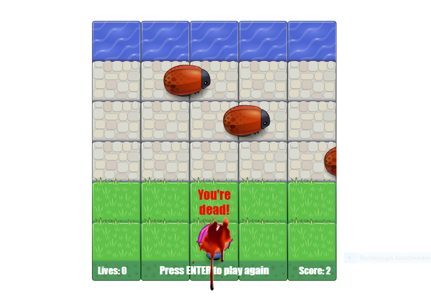

# Arcade Game

This is a simple clone of the classic Arcade Frogger game for the Udacity Web Development course. 
Frogger is a 1981 arcade game developed by Gremlin Industries. The object of the game is to direct
frogs to their homes one by one by crossing a busy road and navigating a river full of hazards.

## Instructions

1. How to run the game

Clone the repo or download and unzip the zip file in any folder on your computer and open the index.html file in your browser.

2. How to play the game

Move the player up, down, left or right with the arrow keys. Your goal is to reach the water at the top of the screen 
and avoid getting eaten by the bugs. Every time you reach the water, the score goes up. You have 5 lives. Every time you
get eaten by a bug, you lose one life. To play again, press the Enter key.

## Licence

The content of this repository is licensed under an [MIT license](https://choosealicense.com/licenses/mit/)
